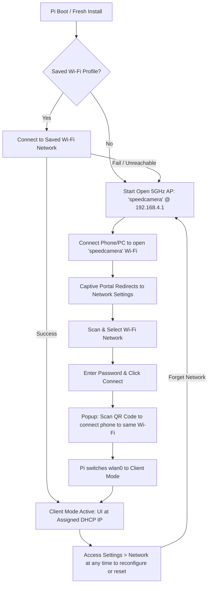

# Speedcamera Headless (Rust & Axum / Socket.io)

A lightweight, high-performance, single-binary speedcamera daemon and responsive web controller written in **Rust** using **Axum 0.8**, **Socketioxide (Socket.io v4)**, **native Aravis C FFI**, **SQLite**, and an embedded **React + Vite** frontend.

Engineered specifically for **Raspberry Pi 5 with Raspberry Pi OS Lite** (zero desktop or GUI dependencies) with ultra-low latency hardware shutter triggering (<10ms) and rock-solid 24/7 reliability. Features an IoT-style onboarding workflow (similar to WLED/ESPHome) with an open 5GHz setup hotspot, captive portal redirection, scannable QR code Wi-Fi onboarding, and dedicated GigE Vision industrial camera networking.

---

## Architecture & Network Operation Modes

```
┌────────────────────────────────────────────────────────────────────────┐
│ Raspberry Pi 5 (Raspberry Pi OS Lite ARM64)                            │
│                                                                        │
│  • eth0 (Camera LAN):    192.168.1.100/24  <── GigE Vision Industrial  │
│                          (or DHCP toggle)      Camera (MTU 9000)       │
│                                                                        │
│  • wlan0 (Wireless):     192.168.4.1/24    <── Open AP Setup Hotspot   │
│                          or DHCP Client IP <── Client Mode (Operation) │
│                                                                        │
│  • speedcamera-rust Daemon (Single Standalone Binary)                  │
│     ├── Axum 0.8 HTTP Server (REST API & Embedded Static Frontend)     │
│     ├── Socketioxide (Socket.io v4 RPC Server & Event Broadcaster)     │
│     ├── Native Aravis C FFI (Direct libaravis-0.8 on eth0)             │
│     ├── Serial Port Reader (serialport @ 115200 baud)                  │
│     ├── Instant Trigger Pipeline (Serial Event -> Camera Shutter <10ms)│
│     ├── SQLite Database (rusqlite WAL mode @ ~/.speedcamera)           │
│     └── Pure Rust Poliscan Overlay Renderer (image + imageproc)        │
└───────────────────────┬─────────────────────────────▲──────────────────┘
                        │ Wi-Fi (AP or Client)        │ Ethernet Cable
                        ▼                             │
┌──────────────────────────────────────────┐   ┌──────────────────────────┐
│ Client Device (Phone / Tablet / Laptop)  │   │ Industrial GigE Camera   │
│                                          │   │                          │
│ • Setup: Connect to open "speedcamera"   │   │ • Subnet: 192.168.1.0/24 │
│ • Normal: Access via local router IP     │   │ • GenICam / Aravis 0.8   │
│ • Scannable QR Code Wi-Fi onboarding     │   │ • Jumbo frames (MTU 9000)│
└──────────────────────────────────────────┘   └──────────────────────────┘
```

---

## Network Onboarding Flow (WLED-Style)



1. **Initial / Fallback AP Mode**:
   - Open 5GHz Wi-Fi Hotspot: SSID **`speedcamera`** (No password, Channel 36, IP `192.168.4.1`).
   - Built-in captive portal automatically opens the web dashboard when connecting from iOS, Android, macOS, or Windows.
2. **Wi-Fi Scanner & QR Code Transition**:
   - Open the **Settings > Network** page (icons only, no emojis).
   - Auto-scans nearby 2.4GHz & 5GHz networks with signal strength %, BSSID, channel, and security.
   - Select your Wi-Fi, enter the password, and click **Connect**.
   - A modal displays a **scannable Wi-Fi QR Code** so your smartphone can instantly switch to the same target network.
3. **Client Operation Mode**:
   - The Pi connects to your local router via DHCP and serves the Web UI and API at its assigned IPv4 address.
   - The dedicated Camera LAN on `eth0` remains active at static `192.168.1.100` (MTU 9000).
4. **Internet / Software Updates**:
   - The Pi has internet access via Wi-Fi client mode.
   - If Wi-Fi is not available, the **Network** tab includes an Ethernet toggle to switch `eth0` to standard DHCP for wired internet access.

---

## Key Improvements Over Legacy Daemon

| Feature | Legacy Bun / Electron | **Native Rust Daemon (`headless-rust`)** |
| :--- | :--- | :--- |
| **Runtime** | Bun / V8 JavaScript VM | **Pure native compiled binary (ELF ARM64 / x86_64)** |
| **Memory Footprint** | ~250MB+ | **~15MB** |
| **Camera Integration** | Flawed FFI / unstable wrapper | **Direct C FFI to `libaravis-0.8` (zero intermediate overhead)** |
| **Shutter Latency** | ~50–150ms JS event loop lag | **<10ms Instant Hardware Shutter Pipeline** |
| **Poliscan Skinning** | Heavy native canvas node addons | **Pure Rust `image` + `imageproc` + embedded TTF font** |
| **Frontend Serving** | Node / Bun file serving | **Baked into binary via `rust-embed` (Single binary deployment!)** |
| **Network Management** | Flaky AP password / drops | **Open AP setup + Client mode + QR Code + Captive Portal** |
| **Database** | Bun SQLite bindings | **Native `rusqlite` with WAL mode & foreign keys** |
| **Stability** | Event loop crashes on buffer overflows | **Ring buffer pool + safe Rust error handling + auto-reconnect** |

---

## Migration Guide (From Old System)

If you are running an existing version of Speedcamera on your Raspberry Pi, follow one of these migration methods:

### Method 1: Remote Automated Update (Recommended)

From your development laptop:

```bash
cd headless-rust

# 1. If Pi is connected to Home LAN / Wi-Fi via DHCP:
bun run deploy:pi pi@raspberrypi.local --build

# 2. Or if currently connected to the Pi's old hotspot (192.168.4.1):
ssh pi@192.168.4.1 '~/speedcamera/headless-rust/scripts/setup-network.sh client "MyHomeWiFi" "MyPassword"'
# Then run deploy:
bun run deploy:pi pi@raspberrypi.local --build
```

### Method 2: Clean Re-Installation (Full Wipe & Fresh Setup)

To remove all legacy services, network profiles, and start completely fresh:

```bash
cd headless-rust

# 1. Clean up old installation and restore DHCP network:
bun run cleanup:pi pi@raspberrypi.local --yes

# 2. Run fresh installation:
bun run install:pi pi@raspberrypi.local
```

### Method 3: Direct on Raspberry Pi (via SSH / Console)

If executing directly on the Raspberry Pi:

```bash
# 1. Pull latest code
cd ~/speedcamera
git pull origin main

# 2. Install new frontend dependency & build
cd ~/speedcamera/headless-rust
bun install
bun run build

# 3. Compile release binary
cargo build --release

# 4. Restart systemd service
sudo systemctl restart speedcamera

# 5. Switch to new Open AP Setup Mode
sudo ./scripts/setup-network.sh ap
```

---

## Fresh Pi OS Requirements & Dependencies

To set up a fresh Raspberry Pi OS image (recommended: **Raspberry Pi OS Lite 64-bit**), the automated installer handles all steps:

```bash
cd headless-rust
bun run install:pi pi@raspberrypi.local
```

### Manual Dependency Reference

#### 1. System Packages (APT)
```bash
sudo apt-get update
sudo apt-get install -y \
  libaravis-0.8-0 \
  libaravis-dev \
  libglib2.0-dev \
  libgobject-2.0-0 \
  libudev-dev \
  pkg-config \
  build-essential \
  esptool \
  network-manager \
  dnsmasq \
  iptables \
  curl \
  unzip \
  git \
  rsync \
  sqlite3 \
  libsqlite3-dev
```

#### 2. Rust Toolchain (`rustup`)
```bash
curl --proto '=https' --tlsv1.2 -sSf https://sh.rustup.rs | sh -s -- -y
source "$HOME/.cargo/env"
```

#### 3. Bun Runtime (`bun.sh`)
```bash
curl -fsSL https://bun.sh/install | bash
source "$HOME/.bashrc"
```

#### 4. GigE Vision Network Socket Buffer & FQ-CoDel Tuning
```bash
sudo bash -c 'cat > /etc/sysctl.d/60-gige-camera.conf <<EOF
net.core.rmem_max = 134217728
net.core.wmem_max = 134217728
net.core.rmem_default = 262144
net.core.wmem_default = 262144
net.ipv4.tcp_rmem = 4096 131072 67108864
net.ipv4.tcp_wmem = 4096 65536 67108864
net.core.netdev_max_backlog = 30000
net.core.default_qdisc = fq_codel
vm.dirty_background_ratio = 5
vm.dirty_ratio = 10
EOF'
sudo sysctl -p /etc/sysctl.d/60-gige-camera.conf
```

---

## Network Script Reference (`setup-network.sh`)

You can inspect or change network modes at any time via the Web UI Settings (**Network** tab) or via CLI:

```bash
# 1. Start Open AP Setup Hotspot (192.168.4.1, no password, captive portal active)
sudo ~/speedcamera/headless-rust/scripts/setup-network.sh ap

# 2. Connect to Wi-Fi network in Client Mode (normal operation)
sudo ~/speedcamera/headless-rust/scripts/setup-network.sh client "MyHomeWiFi" "SecretPassword123"

# 3. Boot auto-mode (reconnects saved client Wi-Fi, falls back to AP if unreachable)
sudo ~/speedcamera/headless-rust/scripts/setup-network.sh auto

# 4. Forget saved Wi-Fi credentials and return to Open AP Setup mode
sudo ~/speedcamera/headless-rust/scripts/setup-network.sh forget

# 5. Set Ethernet interface to dedicated Camera LAN (Static 192.168.1.100, MTU 9000)
sudo ~/speedcamera/headless-rust/scripts/setup-network.sh lan-camera

# 6. Set Ethernet interface to standard DHCP (for wired internet/updates)
sudo ~/speedcamera/headless-rust/scripts/setup-network.sh lan-dhcp

# 7. Scan nearby visible Wi-Fi networks (SSID, BSSID, channel, signal, security)
~/speedcamera/headless-rust/scripts/setup-network.sh scan

# 8. Revert both Ethernet and Wi-Fi to standard DHCP
sudo ~/speedcamera/headless-rust/scripts/setup-network.sh dhcp

# 9. Check active network status, IP addresses, power management, and internet reachability
~/speedcamera/headless-rust/scripts/setup-network.sh status
```

---

## Managing the Service on Raspberry Pi

The Speedcamera daemon runs as a `systemd` background service:

```bash
# Check service status
sudo systemctl status speedcamera

# View live streaming logs
sudo journalctl -u speedcamera -f

# Restart service
sudo systemctl restart speedcamera

# Stop service
sudo systemctl stop speedcamera

# Start service
sudo systemctl start speedcamera
```

---

## Local Development & Testing

```bash
cd headless-rust

# 1. Install frontend dependencies
bun install

# 2. Build frontend assets
bun run build

# 3. Run mock backend (on :3000)
cargo run -- --mock

# 4. Run automated server & WebSocket RPC integration tests
bun run test:server
```

- **Web UI:** `http://localhost:3000`
- **Health Endpoint:** `http://localhost:3000/api/health`
- **Network Endpoint:** `http://localhost:3000/api/network`
- **Socket.io RPC & Events:** `http://localhost:3000/socket.io/`

---

## CLI Options

```
Usage: headless-rust [OPTIONS]

Options:
  -m, --mock         Run in mock hardware mode (no physical camera/serial required)
  -p, --port <PORT>  HTTP server port (default: 3000)
  -H, --host <HOST>  HTTP server bind address (default: 0.0.0.0)
  -h, --help         Print help
```
